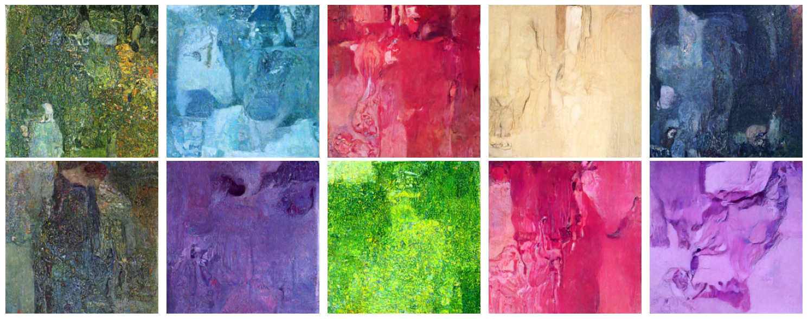

Denoising Diffusion Probabilistic Model trained to imitate Klimt's style of painting.

Trained for 500 epochs on the paintings [on this site](http://art-klimt.com/gallery.html).

Huggingface Repo: https://huggingface.co/maxmarcon/klimt-diffusion

Usage:

```python
from diffusers import DiffusionPipeline

pipe = DiffusionPipeline.from_pretrained("maxmarcon/klimt-diffusion").to("cuda")

images = pipe(10)

import matplotlib.pyplot as plt

fig, axes = plt.subplots(2, 5, figsize=(15, 6))
for axis, image in zip(axes.flat, images[0]):
    axis.imshow(image)
    axis.axis("off")

plt.tight_layout()
plt.show()
```




